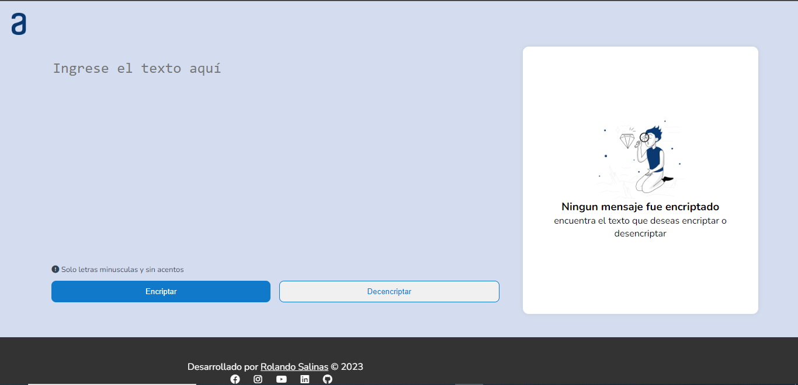

# Challenges-Oracle-ONE

# Descripción:
El proyecto <em>"Challenges-Oracle-ONE Encriptador/Desencriptador de Texto"</em> es una aplicación web que permite encriptar y desencriptar texto utilizando el cifrado César, junto con tecnologías web como HTML, CSS y Javascript. La aplicación proporciona a los usuarios una interfaz intuitiva donde pueden ingresar un mensaje de texto y elegir una clave de encriptación para cifrarlo utilizando el cifrado César. También permite a los usuarios ingresar el texto encriptado y la clave correspondiente para desencriptarlo y obtener el mensaje original.

# Características principales:
<ol>
  <li><b>Interfaz de usuario intuitiva:</b> La aplicación ofrece una interfaz de usuario fácil de usar, diseñada con HTML y CSS, que permite a los usuarios interactuar con la herramienta de encriptado y desencriptado de manera cómoda y eficiente.</li>
  <li><b>Cifrado César:</b> El proyecto utiliza el cifrado César para encriptar el texto ingresado por los usuarios. El cifrado César es un tipo de cifrado de sustitución en el que cada letra en el mensaje original es reemplazada por otra letra que se encuentra un número fijo de posiciones más adelante en el alfabeto.</li>
 
  <li><b>Desencriptado preciso:</b>La aplicación también permite a los usuarios ingresar texto encriptado utilizando el cifrado César junto con la clave de desencriptación correspondiente. Utilizando el algoritmo de descifrado adecuado, el proyecto desencripta el texto y muestra el mensaje original, asegurando una precisión y consistencia óptimas.</li>

  <li><b>Personalización de claves:</b> Personalización de claves: Los usuarios tienen la opción de elegir una clave personalizada para el proceso de encriptación y desencriptación utilizando el cifrado César. Esto les brinda flexibilidad y control sobre la seguridad de sus mensajes.</li>
</ol>

# Tecnologías utilizadas:
<ul>
  <li><b>HTML:</b> Se utiliza para crear la estructura básica de la página web y definir los elementos interactivos de la interfaz de usuario.</li>
  <li><b>CSS:</b> Se emplea para diseñar y estilizar la apariencia visual de la aplicación, mejorando su aspecto y experiencia de usuario.</li>
  <li><b>Javascript:</b> Se utiliza para implementar la lógica del encriptador/desencriptador utilizando el cifrado César, incluyendo los algoritmos de cifrado y descifrado.</li>
</ul>
  
# Requisitos del proyecto:
<b>Navegador web:</b> Los usuarios pueden acceder a la aplicación utilizando cualquier navegador web moderno, ya que la aplicación se basa en tecnologías web estándar.
Este proyecto en GitHub proporciona una solución práctica para encriptar y desencriptar texto utilizando el cifrado César, ofreciendo una herramienta fácil de usar para la protección de información confidencial. Los desarrolladores pueden colaborar en el proyecto, mejorarlo y adaptarlo según sus necesidades específicas.

